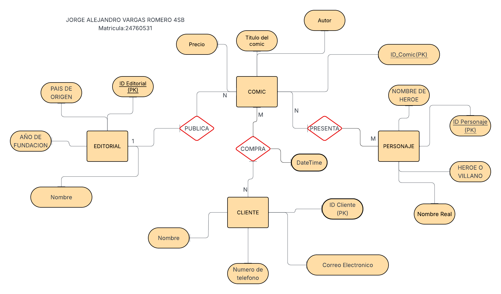
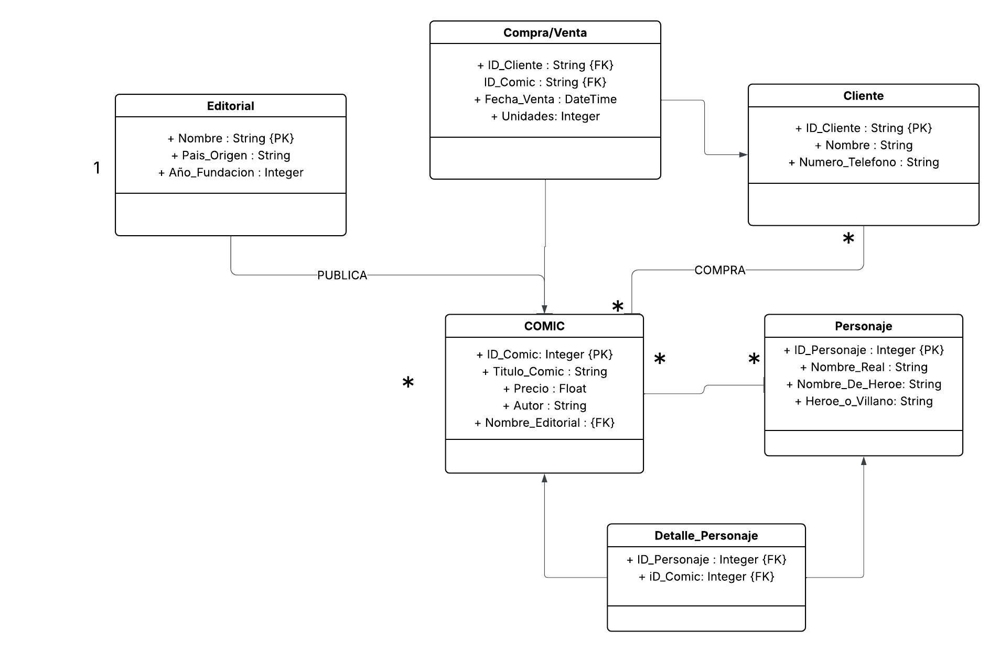

# 📚 Fundamentos de Bases de Datos
## Proyecto
TIENDA DE COMICS SENZCOMICS
### Descripción
Este proyecto es con el fin de realizar una base de datos relacional sobre una tienda de comics en linea, su objetivo es almacenar informacion acerca de los issues en venta, proximos lanzamientos y portadas alternativas
### Motivacion
la creacion de esta base de datos es digitalizar un inventario en fisico para mayor facilidad de encontrar sin necesidad de acudir de forma presencial a la tienda local que se necesite, tambien como un analisis de ventas para ver que personajes tienen una mayor demanda y es mejor invertir, y mayor amplitud de mercado para conseguir mas clientes.
### Modelo E-R 
### Modelo UML 
